# Conditional Formatting Icons

This repository includes the SVG versions of the icons used in Power BI for Conditional Formatting rules. This is especially useful 
if you are looking to create new theme files with custom icons and would like to have a starting point for existing icons. It can also 
be helpful if you are using visualizations that support SVG images but not the built-in icons or in use in images for interactive elements
like buttons and more.

For information about the other UX related icons, please check out the [main readme](/README.md) for the repo.

## Icon Overview Sample
A sample Power BI Desktop file (.pbix) has been included to make it easy to setup a conditional formatting lookup table in your Power BI reports.

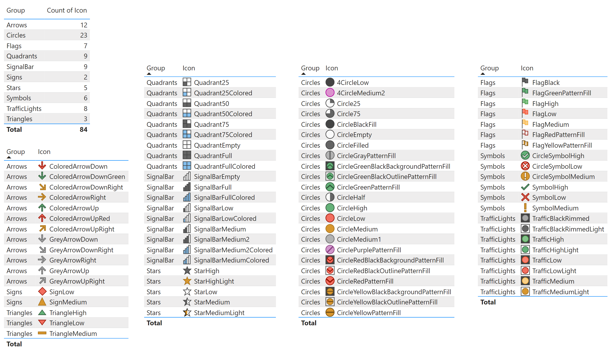

## Available images
The following images are available:

Note: The group names below are only for illustrative purposes and do not serve a function within Power BI itself.

|Group|Icon|SVG|
|--|--|--|
|Arrows|ColoredArrowDown||
|Arrows|ColoredArrowDownGreen||
|Arrows|ColoredArrowDownRight||
|Arrows|ColoredArrowRight|<a href="SVG/ColoredArrowRight.svg">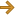</a>|
|Arrows|ColoredArrowUp||
|Arrows|ColoredArrowUpRed||
|Arrows|ColoredArrowUpRight|<a href="SVG/ColoredArrowUpRight.svg">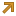</a>|
|Arrows|GreyArrowDown||
|Arrows|GreyArrowDownRight||
|Arrows|GreyArrowRight||
|Arrows|GreyArrowUp||
|Arrows|GreyArrowUpRight||
|Circles|4CircleLow||
|Circles|4CircleMedium2||
|Circles|Circle25||
|Circles|Circle75||
|Circles|CircleBlackFill||
|Circles|CircleEmpty||
|Circles|CircleFilled||
|Circles|CircleGrayPatternFill||
|Circles|CircleGreenBlackBackgroundPatternFill||
|Circles|CircleGreenBlackOutlinePatternFill|<a href="SVG/CircleGreenBlackOutlinePatternFill.svg">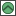</a>|
|Circles|CircleGreenPatternFill||
|Circles|CircleHalf||
|Circles|CircleHigh||
|Circles|CircleLow||
|Circles|CircleMedium||
|Circles|CircleMedium1||
|Circles|CirclePurplePatternFill||
|Circles|CircleRedBlackBackgroundPatternFill||
|Circles|CircleRedBlackOutlinePatternFill||
|Circles|CircleRedPatternFill||
|Circles|CircleYellowBlackBackgroundPatternFill||
|Circles|CircleYellowBlackOutlinePatternFill|<a href="SVG/CircleYellowBlackOutlinePatternFill.svg">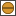</a>|
|Circles|CircleYellowPatternFill||
|Flags|FlagBlack||
|Flags|FlagGreenPatternFill||
|Flags|FlagHigh||
|Flags|FlagLow||
|Flags|FlagMedium||
|Flags|FlagRedPatternFill|<a href="SVG/FlagRedPatternFill.svg">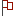</a>|
|Flags|FlagYellowPatternFill|<a href="SVG/FlagYellowPatternFill.svg">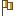</a>|
|Quadrants|Quadrant25||
|Quadrants|Quadrant25Colored||
|Quadrants|Quadrant50||
|Quadrants|Quadrant50Colored||
|Quadrants|Quadrant75||
|Quadrants|Quadrant75Colored||
|Quadrants|QuadrantEmpty||
|Quadrants|QuadrantFull||
|Quadrants|QuadrantFullColored||
|Signal Bars|SignalBarEmpty||
|Signal Bars|SignalBarFull||
|Signal Bars|SignalBarFullColored||
|Signal Bars|SignalBarLow||
|Signal Bars|SignalBarLowColored||
|Signal Bars|SignalBarMedium||
|Signal Bars|SignalBarMedium2||
|Signal Bars|SignalBarMedium2Colored||
|Signal Bars|SignalBarMediumColored||
|Signs|SignLow|<a href="SVG/SignLow.svg">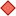</a>|
|Signs|SignMedium||
|Stars|StarHigh||
|Stars|StarHighLight||
|Stars|StarLow||
|Stars|StarMedium||
|Stars|StarMediumLight||
|Symbols|CircleSymbolHigh||
|Symbols|CircleSymbolLow||
|Symbols|CircleSymbolMedium||
|Symbols|SymbolHigh||
|Symbols|SymbolLow||
|Symbols|SymbolMedium|<a href="SVG/SymbolMedium.svg">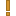</a>|
|Traffic Lights|TrafficBlackRimmed||
|Traffic Lights|TrafficBlackRimmedLight|<a href="SVG/TrafficBlackRimmedLight.svg">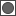</a>|
|Traffic Lights|TrafficHigh||
|Traffic Lights|TrafficHighLight|<a href="SVG/TrafficHighLight.svg">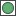</a>|
|Traffic Lights|TrafficLow||
|Traffic Lights|TrafficLowLight|<a href="SVG/TrafficLowLight.svg">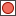</a>|
|Traffic Lights|TrafficMedium||
|Traffic Lights|TrafficMediumLight|<a href="SVG/TrafficMediumLight.svg">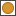</a>|
|Triangles|TriangleHigh||
|Triangles|TriangleLow||
|Triangles|TriangleMedium||