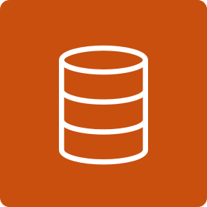

# Power BI Icons (archive)

This repository is no longer getting updated. Find the icons for Fabric in [the Fabric documentation](https://learn.microsoft.com/fabric/get-started/icons).

This repository contains PNG and SVG versions of icons for Power BI, provided to you to use in your documents or architecture diagrams.
Usage of these icons is subject to the license under which they are provided (see [legal notices](#legal-notices)).

Are you looking for Fabric icons? They are not provided here, but instead you can find them in [the Fabric documentation](https://learn.microsoft.com/fabric/get-started/icons).

Note: you might be seeing different versions of these icons depending on what application you are using. These are the current official icons.

## Available images
The following images are available:

|Icon / Logo|PNG|SVG|
|--|--|--|
|Any (Power Query data type)|||
|App|||
|Binary (Power Query data type)|||
|Browse|||
|Calculated Column|||
|Calculated Column Numeric|||
|Calculated Table|||
|Certified|||
|Change Detection Measure|||
|Computed Entity|||
|Create|||
|Dataflow|||
|Datagroup|||
|Datahub|||
|Datamart|||
|Datamart - Automatically update|||
|Datamart - Incrementally update|||
Datamart - Manually Update|||
Dashboard|||
|Dataset|||
|Dataverse|&nbsp;|&nbsp;|
|DateTime Field|||
|Date (Power Query data type)|||
|Date/Time (Power Query data type)|||
|Date/Time/Timezone (Power Query data type)|||
|Decimal number (Power Query data type)|||
|Delete|||
|Deployment Pipeline|||
|Deployment Pipeline - Development|||
|Deployment Pipeline - Production|||
|Deployment Pipeline - Test|||
|DirectQuery|||
|Discover|||
|Dual|||
|Duration (Power Query data type)|||
|Excel Workbook|||
|Favorites|||
|Fixed Decimal Number / Currency (Power Query data type)|||
|Folder|||
|Function|||
|Geospatial Field|||
|Hierarchy|||
|Identity Field|||
|Import|||
|KPI|||
|Learn|||
|Linked Entity|||
|List (Power Query)|||
|Live Connection|||
|Manage Permissions|||
|Measure|||
|Measure Group|||
|Metrics|||
|Model|||
|Numeric Field|||
|Paginated Report|||
|Parameter|||
|Percentage (Power Query data type)|||
|Power Apps|&nbsp;|&nbsp;|
|Power Automate|&nbsp;|&nbsp;|
|Power BI|||
|Power BI (obsolete 2020)|&nbsp;&nbsp;||
|Power BI Datasource file (PBIDS)|||
|Power BI Desktop|||
|Power BI Desktop optimized for Report Server|||
|Power BI File (PBIX)|||
|Power BI Report Builder|||
|Power BI Template file (PBIT)|||
|Power Pages|||
|Power Query|||
|Power Virtual Agents|&nbsp;|&nbsp;|
|Premium|||
|Premium Per User|||
|Promoted|||
|Query|||
|Recent|||
|Record (Power Query)|||
|Rename|||
|Report|||
|Row-level security (RLS)|||
|Shared With Me|||
|SQL Query|||
|Streaming Dataset|||
|Streaming Dataflow|||
|Table|||
|Table (Power Query)|||
|Text (Power Query data type)|||
|Time (Power Query data type)|||
|True / False (Power Query data type)||
|Visual Query|||
|Warning|||
|Workspace|||
|Whole Number (Power Query data type)|||

# Contributing

This project welcomes contributions and suggestions.  Most contributions require you to agree to a
Contributor License Agreement (CLA) declaring that you have the right to, and actually do, grant us
the rights to use your contribution. For details, visit https://cla.opensource.microsoft.com.

When you submit a pull request, a CLA bot will automatically determine whether you need to provide
a CLA and decorate the PR appropriately (e.g., status check, comment). Simply follow the instructions
provided by the bot. You will only need to do this once across all repos using our CLA.

This project has adopted the [Microsoft Open Source Code of Conduct](https://opensource.microsoft.com/codeofconduct/).
For more information see the [Code of Conduct FAQ](https://opensource.microsoft.com/codeofconduct/faq/) or
contact [opencode@microsoft.com](mailto:opencode@microsoft.com) with any additional questions or comments.

# Legal Notices

Microsoft and any contributors grant you a license to the Microsoft documentation and other content
in this repository under the [Creative Commons Attribution 4.0 International Public License](https://creativecommons.org/licenses/by/4.0/legalcode),
see the [LICENSE](LICENSE) file, and grant you a license to any code in the repository under the [MIT License](https://opensource.org/licenses/MIT), see the
[LICENSE-CODE](LICENSE-CODE) file.

Microsoft, Windows, Microsoft Azure and/or other Microsoft products and services referenced in the documentation
may be either trademarks or registered trademarks of Microsoft in the United States and/or other countries.
The licenses for this project do not grant you rights to use any Microsoft names, logos, or trademarks.
Microsoft's general trademark guidelines can be found at http://go.microsoft.com/fwlink/?LinkID=254653.

Privacy information can be found at https://privacy.microsoft.com/en-us/

Microsoft and any contributors reserve all other rights, whether under their respective copyrights, patents,
or trademarks, whether by implication, estoppel or otherwise.
